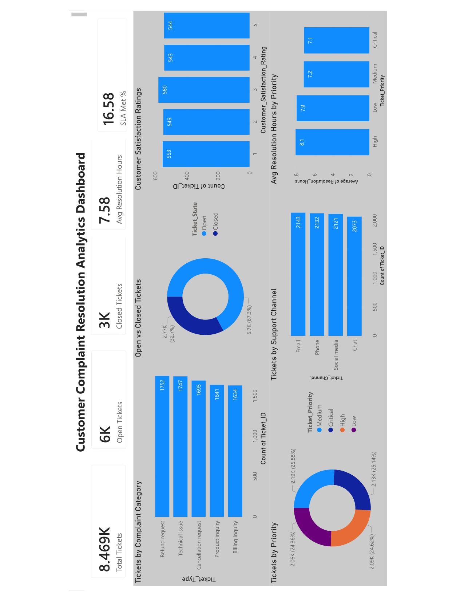

# 📞 Customer Support Performance & SLA Analysis

_Analyzing customer support operations to identify inefficiencies in ticket resolution, SLA compliance, and customer satisfaction._

---

## Table of Contents
- <a href="#overview">Overview</a>
- <a href="#business-problem">Business Problem</a>
- <a href="#key-metrics">Key Metrics</a>
- <a href="#key-insights">Key Insights</a>
- <a href="#analysis-approach">Analysis Approach</a>
- <a href="#dashboard">Dashboard</a>
- <a href="#sql-queries">SQL Queries</a>
- <a href="#business-recommendations">Business Recommendations</a>
- <a href="#author--contact">Author & Contact</a>

---

<h2>📖 Overview</h2>

This project evaluates the performance of a customer support system using ticket-level data.  
The goal is to identify operational bottlenecks, measure SLA compliance, and uncover patterns in customer issues to improve service efficiency and customer experience.

---

<h2>🎯 Business Problem</h2>

Customer support teams handle large volumes of tickets, but inefficiencies in resolution time, backlog management, and SLA adherence can negatively impact customer satisfaction and operational performance.

This project aims to:
- Identify ticket backlog and resolution gaps
- Measure SLA compliance across all tickets
- Analyze complaint patterns and recurring issues
- Evaluate customer satisfaction across issue types

---

<h2>📊 Key Metrics</h2>

- **Total Tickets:** 8,469
- **Open Tickets:** 5,700 (~67%)
- **Closed Tickets:** 2,769 (~33%)
- **Average Resolution Time:** ~1.26 hours
- **SLA Compliance Rate:** ~16% (overall)

---

<h2>🔍 Key Insights</h2>

-  **High backlog pressure:**  
  ~67% of tickets remain open, indicating a significant accumulation of unresolved issues
-  **Low SLA compliance (~16%):**  
  A large proportion of tickets fail to meet SLA targets, highlighting inefficiencies in resolution processes
-  **Better performance among resolved cases:**  
  ~50% of closed tickets meet SLA, suggesting delays are primarily driven by unresolved backlog
-  **Recurring issues dominate workload:**  
  Refund requests (1,752) and technical issues (1,747) are the most frequent complaints
-  **Low customer satisfaction (~1.0 avg):**  
  Especially poor ratings for cancellation-related issues, indicating dissatisfaction with critical workflows
-  **Balanced workload across priorities:**  
  Ticket priority distribution is evenly spread, meaning inefficiency is not limited to high-priority cases

---

<h2>📊 Analysis Approach</h2>

- Used **SQL** to calculate KPIs, SLA compliance, and ticket distribution
- Performed aggregation across:
  - Ticket categories
  - Priority levels
  - Communication channels
- Analyzed resolution time and customer satisfaction patterns
- Built a **Power BI dashboard** to visualize operational performance

---

<h2>📊 Dashboard</h2>

The dashboard provides insights into:
- Ticket volume and backlog
- SLA performance
- Complaint category distribution
- Resolution time trends
- Customer satisfaction patterns

---

<h2> SQL Queries</h2>

All queries used for analysis:  
[View SQL Queries](sql/analysis_queries_1.sql)

---

<h2>💡 Business Recommendations</h2>

- **Reduce backlog:**  
  Prioritize high-volume categories (refunds, technical issues) to improve closure rates
- **Improve SLA compliance:**  
  Introduce stricter monitoring and escalation mechanisms for delayed tickets
- **Address root causes:**  
  Fix recurring issues (e.g., refund processing, technical bugs) at the product/process level
- **Enhance customer experience:**  
  Improve handling of cancellation requests to increase satisfaction scores
- **Optimize support channels:**  
  Balance workload across channels (email, phone, chat) to improve response efficiency

---

<h2>👤 Author & Contact</h2>

**Arnav Jha**  
Data Analyst
- 📧 Email: (arnavjha3112@gmail.com) 
- 🔗 [LinkedIn](https://www.linkedin.com/in/arnavkumarjha/)
- 🐙 [Github](https://github.com/arnavjha-3112)

